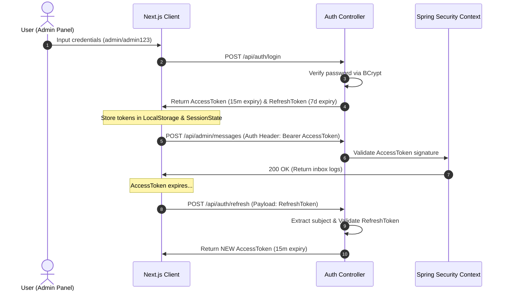

# System Architecture Documentation - HQ Platform

This document describes the high-level system architecture, request flows, authentication lifecycles, and deployment parameters for Abhinandan Naik's Enterprise Portfolio platform.

---

## 1. System Topology

The platform is designed as a decoupled, multi-tier system coordinates by Nginx reverse proxy routing inside a secure Docker network.

```mermaid
graph TD
    User([Browser Client]) ➔|HTTPS Port 443| Nginx{Nginx Proxy}
    Nginx ➔|Port 3000| NextJS[Next.js App Router]
    Nginx ➔|Port 8080 /api| SpringBoot[Spring Boot 3.5 JAR]
    SpringBoot ➔|Spring Data JPA| Postgres[(PostgreSQL DB)]
    SpringBoot ➔|Redis Starter| Cache[(Redis Cache)]
    Prometheus[Prometheus Scraper] ➔|/api/actuator/prometheus| SpringBoot
    Grafana[Grafana Dashboard] ➔|Port 3000| Prometheus
```

### Components

1. **Client Tier**: Next.js 15 App Router running React 19, managing interactive Three.js 3D animations and calling REST endpoints.
2. **Reverse Proxy / Routing**: Nginx server handling SSL termination, static media proxying, and path forwarding.
3. **Core Services**: Java 21 + Spring Boot 3.5 executable jar handling security context filter chains and CRUD operations.
4. **Caching Layer**: Redis instance for fast analytics aggregation and contact form rate limiter buckets.
5. **Database**: PostgreSQL relational storage maintaining transactional records.
6. **Observability**: Prometheus scraping Actuator metrics every 15s, reporting to Grafana dashboards.

---

## 2. Authentication Flow (JWT Lifecycles)

We implement stateless, JWT-based authentication using two tokens: an Access Token and a Refresh Token.



---

## 3. Caching Strategy

To achieve sub-15ms response latency targets, Spring Caching is applied:
- **Write-Through**: Creating or updating resources (e.g. updating a project or publishing a blog) automatically clears query cache buckets (`@CacheEvict`).
- **Read-Ahead**: Queries (GET `/api/projects` and `/api/skills`) are cached directly in Redis with a 10-minute Time-To-Live (TTL).
- **Fallback**: Under the local development profile, Spring uses an in-memory `ConcurrentHashMap` cache, avoiding external Redis dependencies.

---

## 4. Telemetry Collection & Observability

Observability tracks JVM health and visitor behavior:
- **JVM Observability**: Spring Boot Actuator registers garbage collection frequencies, active DB connections in HikariCP pool, and memory usages.
- **Visitor Telemetry**: Next.js client generates a unique session key, tracking page loads and document downloads. Telemetry records are pushed to `/api/analytics` and stored in PostgreSQL.
