# Database Schema Documentation - HQ relational models

This document provides details of the PostgreSQL relational tables, field attributes, constraints, indexes, and entity relationship diagrams.

---

## 1. Entity Relationship Diagram

```mermaid
erDiagram
    USERS {
        bigint id PK
        varchar username UK
        varchar password
        varchar role
    }
    PROJECTS {
        bigint id PK
        varchar name
        varchar subtitle
        text description
        varchar tech_stack
        varchar live_url
        varchar github_url
        text features
        text challenges
        text impact
        text metrics
    }
    SKILLS {
        bigint id PK
        varchar name
        varchar category
        int proficiency_level
        varchar planetary_coords
    }
    EXPERIENCES {
        bigint id PK
        varchar role
        varchar company
        varchar period
        text description
        text highlights
    }
    CERTIFICATIONS {
        bigint id PK
        varchar name
        varchar organization
        varchar issue_date
        varchar verification_url
        varchar skills_gained
    }
    BLOGS {
        bigint id PK
        varchar title
        varchar slug UK
        text content
        varchar summary
        boolean published
        timestamp created_at
        timestamp updated_at
        varchar tags
        varchar categories
    }
    CONTACT_MESSAGES {
        bigint id PK
        varchar name
        varchar email
        varchar subject
        text message
        timestamp created_at
        boolean is_read
    }
    VISITOR_ANALYTICS {
        bigint id PK
        varchar session_id
        varchar ip_address
        varchar country
        varchar device_type
        varchar browser
        varchar page_visited
        int duration
        varchar action_performed
        timestamp timestamp
    }
    SYSTEM_LOGS {
        bigint id PK
        varchar level
        varchar logger
        text message
        text exception
        timestamp created_at
    }
```

---

## 2. Table Index Definitions

To ensure high-throughput reads (under 15ms targets), the following index rules are specified inside our SQL schemas:

1. **Unique Constraints**:
   - `users(username)`: Allows fast lookups on administrators.
   - `blogs(slug)`: Enables fast matching of routing requests.

2. **Index Optimization**:
   - `visitor_analytics(timestamp)`: Accelerates sorting and logging queries.
   - `blogs(published, created_at)`: Speeds up published CMS pagination fetches.
   - `skills(category)`: Optimizes constellation group searches.
   - `system_logs(level, created_at DESC)`: Speeds up severity-filtered log auditing queries.

